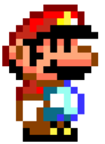
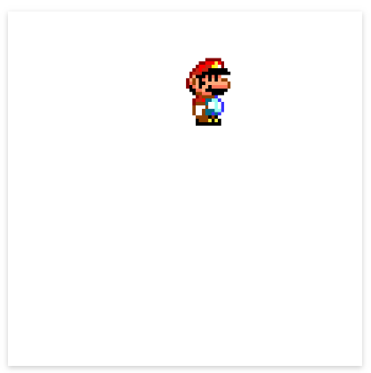

import { Box } from "@rebass/grid";
import AudioPlayer from "react-audio-player";
import { CodeWave } from "gatsby-theme-waves";

## Importando y usando nuestra primera imagen

Para facilitar la forma en la que trabajamos, parcel maneja una forma muy simple
de importar recursos externos que nos permite trabajar con rapidez. Lo primero
que conviene hacer si queremos importar una imagen, y mantener buen orden en el
ambiente de trabajo, es crear una carpeta en donde almacenemos todos nuestros
recursos.

Para esto, crearé una carpeta en la raíz de mi proyecto llamada `assets`. En
ella guardaré todos los elementos multimedia de mi proyecto, como imágenes,
sonidos, videos, etcétera.

Mis carpetas del proyecto se ven así:

```
proyecto
  │
  └─ src
  │   └ index.ts
  │
  └─ assets
```

Importaré ahora la imagen de uno de mis personajes favoritos:



Puedes descargarla de aquí mismo o utilizar la imagen de tu personaje favorito
para el ejercicio.

Después de descargarla y poner el archivo en mi carpeta de assets puedo usarla
dentro de mi `index.ts`. Esto se hace de la siguiente forma:

```ts
import imagenPersonaje from "/assets/mario.png";
```

A partir de este momento, los datos que conforman la imagen de mi personaje
están guardadas dentro de la variable llamada `imagenPersonaje`, y puedo usarla
cuando guste. Para utilizarla, es necesario crear un nuevo objeto de la clase
`HTMLImageElement` (veremos más detalles de esta clase en el futuro) e indicarle
al canvas dónde queremos posicionarla:

```ts
import imagenPersonaje from "/assets/mario.png";

const canvas = document.getElementById("game-area") as HTMLCanvasElement;
const context: CanvasRenderingContext2D = canvas.getContext("2d");

const imageElement = new Image();
imageElement.src = imagenPersonaje;

// drawImage(imagen, coordenadaX, coordenadaY)
context.drawImage(imageElement, 50, 100);
```

¡Listo! Nuestro personaje debe aparecer en el canvas y debe verse algo así:


Pero... hay un problema, ¿no? La imagen puede resultar muy grande si queremos
utilizarla para el juego. Para esto, la función drawImage cuenta con una
variante que nos permite cambiar el tamaño de nuestra imagen:

```ts
drawImage(imagen, coordenadaX, coordenadaY, anchuraFinal, alturaFinal);
```

Con esta función, podemos cambiar la anchura y altura de nuestra imagen según
necesitemos, de modo que podemos dibujar un mario tan ancho...


O tan delgado como queramos:


Para hacerlo chico, solo es necesario cambiar el ancho y alto final a las
dimensiones que queremos. Esto se hace del siguiente modo:

```ts
context.drawImage(image, 200, 50, 55, 80);
```

Con esto, estoy dibujando la imagen guardada en la variable `image`, en las
coordenadas (200, 50), y haciendo que tenga un ancho final de 55 pixeles y una
altura de 80 pixeles. Mi resultado final es este:



> Existe otra variante que sirve para utilizar sub-secciones de una imagen.
> Hablaremos de ella más tarde, pero puedes leer más en la
> [Documentación oficial de drawImage](https://developer.mozilla.org/es/docs/Web/API/CanvasRenderingContext2D/drawImage)

Ahora existe un problema: nuestro personaje está estático y volteando hacia un
solo lado. ¿Qué pasaría si quisieramos caminar hacia el otro? ¿Tendríamos que
cambiar la imagen constantemente? Aunque esto es posible, existen una serie de
funciones dentro del contexto en 2d que nos permiten modificar la posición,
tamaño, y otras cosas de este.

## Transformaciones de contexto

Imaginemos que estamos desarrollando un juego de plataformas similar a Mario
Bros. Nuestro personaje salta, corre, se agacha, aplasta enemigos, todo
perfecto. Sin embargo, existe un pequeño problema: ¡no puede voltear a la
izquierda! Tal vez puede caminar hacia ese lado, pero parececiera que camina
hacia atrás. ¿Cómo podemos arreglar esto?

Para este tipo de casos, los contextos en 2d de HTML permiten hacer manipulación
de coordenadas, escala, ancho, alto, entre otras cosas, todo con facilidad.
Suponiendo que quisieramos cambiar la coordenadas del personaje usando estas
funciones, lo haríamos de la siguiente forma:

```ts
// No olvides guardar y recuperar el estado del canvas, ¡es muy impotante!
context.save();
// Movemos el contexto a la izquierda, para que se dibujen ahí los elementos
context.translate(-200, 20);
context.drawImage(image, 200, 50, 55, 80);
context.restore();
```

Con esto, la imagen se posicionará 200 pixeles a la izquierda y 20 arriba de
donde le indique que debe dibujarse.

De una forma similar, puedo hacer que la imagen se voltee utilizando la función
`scale` y asignando una escala de -1:

```ts
context.save();
context.translate(-200, 20);
context.scale(-1, 1);
context.drawImage(image, 200, 50, 55, 80);
context.restore();
```

Pero... ¿qué pasó? ¡El personaje desapareció del canvas!

Esto ocurre porque estamos haciendo un doble desplazamiento del personaje,
primero con `translate`, luego con `drawImage`. Para arreglar esto, solo es
necesario cambiar las coordenadas de modo que solo hagamos el cambio una sola
vez:

```ts
context.save();
context.translate(200, 20);
context.scale(-1, 1);
context.drawImage(image, 0, 0, 55, 80);
context.restore();
```

Y listo, nuestro personaje está volteando a la izquierda, pero hay otro
problema, su posición cambió. Esto se debe a que ahora el eje de dibujo está
moviéndose junto con el personaje, en vez de que su origen esté en la parte
superior izquierda, se encuentra en la parte superior derecha. Podemos
arreglarlo almacenando la dirección en una variable y agregando el ancho de la
imagen cuando el personaje voltea a la izquierda, de modo que la posición no se
vea afectada:

```ts
// Todo en una función, para mejorar el orden del código
function drawCharacter() {
  // Almacenamos la dirección del personaje, 1 es a la derecha, -1 a la izquierda
  const direction = 1;
  const characterWidth = 55;
  let currentX = 200;

  // Si el personaje está volteando a la izquierda, es necesario restaurar la
  // posición del dibujo
  if (direction === -1) {
    // restauramos la posición del personaje
    currentX = currentX + characterWidth;
  }

  context.save();
  context.translate(currentX, 20);
  context.scale(direction, 1);
  context.drawImage(image, 0, 0, characterWidth, 80);
  context.restore();
}

// Hacer que el personaje se dibuje
drawCharacter();
```

Y listo, con esto el personaje cambiará su posición cuando modifiquemos la
dirección en este está volteando.

Aunque ya podemos utilizar imágenes, hay algo más que le falta a nuestro juego
para ser divertido... ¡Ah, claro! Le falta música y sonido. Veamos ahora cómo
usar este tipo de recursos.

## Importando y usando nuestro primer sonido

Usar audio en un ambiente web es muy sencillo. Para esto, utilizaremos un
[HTMLAudioElement](https://developer.mozilla.org/en-US/docs/Web/API/HTMLAudioElement)
que nos da una serie de métodos que podemos usar con facilidad. Puedes usar la
música que quieras. En mi caso, usaré música de Mario & Luigi: Superstar Saga:

<Box mb={3}>
  <AudioPlayer
    src="/mlss-world-map.mp3"
    controls
    style={{ margin: "0 auto", display: "block" }}
  />
</Box>

El uso de un elemento de audio se hace de la siguiente manera:

<CodeWave>

```ts
import imagenPersonaje from "/assets/mario.png";

const canvas = document.getElementById("game-area") as HTMLCanvasElement;
const context: CanvasRenderingContext2D = canvas.getContext("2d");

context.drawImage(imageElement, 50, 100);
```

Este es el código actual de nuestra aplicación.

```ts
import imagenPersonaje from "/assets/mario.png";
import audio from "/assets/mlss-world-map.mp3";

const canvas = document.getElementById("game-area") as HTMLCanvasElement;
const context: CanvasRenderingContext2D = canvas.getContext("2d");

context.drawImage(imageElement, 50, 100);
```

Primero que nada, importamos el sonido que se reproducirá, de un modo muy
similar a como hicimos con la imagen en la sección pasada.

```ts
import imagenPersonaje from "/assets/mario.png";
import audio from "/assets/mlss-world-map.mp3";

const canvas = document.getElementById("game-area") as HTMLCanvasElement;
const context: CanvasRenderingContext2D = canvas.getContext("2d");

context.drawImage(imageElement, 50, 100);

const sound = new Audio(audio);
```

Después de esto, creamos un nuevo `HTMLAudioElement` usando la clase `Audio` y
le indicamos que queremos utilizar el sonido que acabamos de importar

```ts
import imagenPersonaje from "/assets/mario.png";
import audio from "/assets/mlss-world-map.mp3";

const canvas = document.getElementById("game-area") as HTMLCanvasElement;
const context: CanvasRenderingContext2D = canvas.getContext("2d");

context.drawImage(imageElement, 50, 100);

const sound = new Audio(audio);
sound.play();
```

Finalmente utilizamos `sound.play()` para reproducir el sonido. Con esto, la
música se reproducirá automáticamente una vez que nuestro documento se
compile.

</CodeWave>

Con esto, el sonido debería empezar a reproducirse de forma automática en
nuestro ambiente.

### Eventos de teclado y sonido

Además de poder reproducirlo, los `HTMLAudioElements` nos dan una serie de
opciones que nos permiten, entre otras cosas, cambiar el volumen, autoreproducir
sonidos, ponerlos en loop, etcétera. Para modificar el volumen con las flechas
del teclado, podríamos hacer algo como esto:

```ts
// Cada vez que se presiona una tecla
canvas.addEventListener("keydown", event => {
  const currentVolume = sound.volume;
  let newVolume = currentVolume;
  // El volumen aumenta o disminuye un 10% con cada cambio
  const step = 0.1;

  switch (event.which) {
    // flecha de arriba
    case 38:
      newVolume = currentVolume + step;
      if (newVolume >= 1) {
        newVolume = 1;
      }
      break;
    // Flecha de abajo
    case 40:
      newVolume = currentVolume - step;
      if (newVolume <= 0) {
        newVolume = 0;
      }
      break;
  }

  // Asignar nuevo valor de volumen
  sound.volume = newVolume;
});
```

¿Puedes hacer que la música se detenga o continúe reproduciéndose cada vez que
presionas espacio? ¡Prueba haciendo este tipo de cambios con otras teclas y
viendo qué opciones te dan canvas el elemento de audio para ver todas las
posibilidades que este API te da!

---

Con esto ya podemos hacer interacciones de audio, imágenes y teclado en nuestro
juego, por lo que podemos empezar a crear un ambiente con más movilidad en
tiempo real. Sin embargo, nuestro espacio de trabajo empieza a desorganizarse,
por lo que en la siguiente publicación daremos un repaso de programación
orientada a objetos y empezaremos a organizarlo todo en una serie de clases que
nos permitirán reutilizar nuestro código con facilidad.
