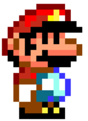
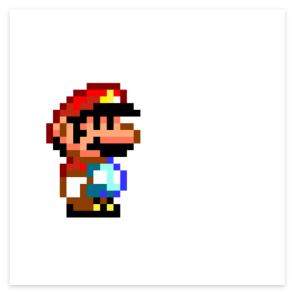
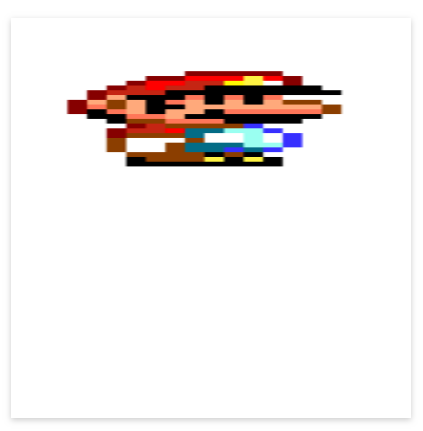
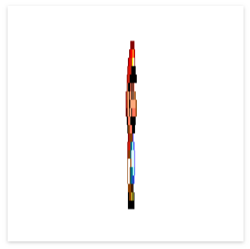

import { Box } from "@rebass/grid";

## Importando y usando nuestra primera imagen

Para facilitar la forma en la que trabajamos, parcel maneja una forma muy simple
de importar recursos externos que nos permite trabajar con rapidez. Lo primero
que conviene hacer si queremos importar una imagen, y mantener buen orden en el
ambiente de trabajo, es crear una carpeta en donde almacenemos todos nuestros
recursos.

Para esto, crearé una carpeta en la raíz de mi proyecto llamada `assets`. En
ella guardaré todos los elementos multimedia de mi proyecto, como imágenes,
sonidos, videos, etcétera.

Mis carpetas del proyecto se ven así:

```
proyecto
  │
  └─ src
  │   └ index.ts
  │
  └─ assets
```

Importaré ahora la imagen de uno de mis personajes favoritos:



Puedes descargarla de aquí mismo o utilizar la imagen de tu personaje favorito
para el ejercicio.

Después de descargarla y poner el archivo en mi carpeta de assets puedo usarla
dentro de mi `index.ts`. Esto se hace de la siguiente forma:

```ts
import imagenPersonaje from "/assets/mario.png";
```

A partir de este momento, los datos que conforman la imagen de mi personaje
están guardadas dentro de la variable llamada `imagenPersonaje`, y puedo usarla
cuando guste. Para utilizarla, es necesario crear un nuevo objeto de la clase
`HTMLImageElement` (veremos más detalles de esta clase en el futuro) e indicarle
al canvas dónde queremos posicionarla:

```ts
import imagenPersonaje from "/assets/mario.png";

const canvas = document.getElementById("game-area") as HTMLCanvasElement;
const context: CanvasRenderingContext2D = canvas.getContext("2d");

const imageElement = new Image();
imageElement.src = imagenPersonaje;

// drawImage(imagen, coordenadaX, coordenadaY)
context.drawImage(imageElement, 50, 100);
```

¡Listo! Nuestro personaje debe aparecer en el canvas y debe verse algo así:



Pero... hay un problema, ¿no? La imagen puede resultar muy grande si queremos
utilizarla para el juego. Para esto, la función drawImage cuenta con una
variante que nos permite cambiar el tamaño de nuestra imagen:

```ts
drawImage(imagen, coordenadaX, coordenadaY, anchuraFinal, alturaFinal);
```

Con esta función, podemos cambiar la anchura y altura de nuestra imagen según
necesitemos, de modo que podemos dibujar un mario tan ancho...



O tan delgado como queramos:



Aunque ya podemos utilizar imágenes, hay algo más que le falta a nuestro juego
para ser divertido... ¡Ah, claro! Le falta música y sonido.

> Existe otra variante que sirve para utilizar sub-secciones de una imagen.
> Hablaremos de ella más tarde, pero puedes leer más en la
> [Documentación oficial de drawImage](https://developer.mozilla.org/es/docs/Web/API/CanvasRenderingContext2D/drawImage)

## Importando y usando nuestro primer sonido

## Reproducción de sonidos por eventos
