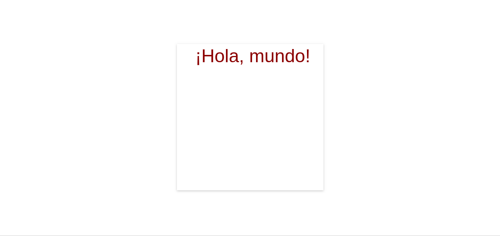

import { CodeWave } from "gatsby-theme-waves";

Para este punto ya sabes cómo hacer uso de canvas para dibujar figuras básicas,
colorearlas, usar bordes en ellas, y moverlas de un lado a otro, pero, ¿puedes
imaginarte cómo sería crear texto con figuras así? Tener que definir cada
instrucción para poder escribir una sola palabra es algo complejo, por lo que
Canvas nos proporciona una manera sencilla de manejar texto en la pantalla.

## Conociendo fillText y strokeText

La manera en que funcionan estas herramienta es muy similar a lo que hicimos en
el ejercicio pasado. Para comenzar, es necesario definir la font que queremos
utilizar, esto se hace por medio de `context.font` de la siguiente manera:

```js
context.font = "40px serif";
```

Para facilitar el manejo individual de textos, `font` utiliza la misma [sintaxis
de definición de fuentes](https://developer.mozilla.org/en-US/docs/Web/CSS/font)
que CSS. En este caso, estamos definiendo que el tamaño a utilizar será de 40px
y que se utilizará la variante serif de las fuentes del usgatsby-resp-image-background-imageuario.

Después de haber definido la font solamente es necesario utilizar la función
`fillText` para que el texto se muestre en el canvas. Se usa de esta forma:

```js
context.fillText(texto, puntoX, puntoY);
// Ejemplo:
// context.fillText("¡Hola, mundo!", 50, 50);
```

El ejemplo completo se vería algo así:

```jsx
context.font = "40px serif";
context.fillText("¡Hola, mundo!", 50, 50);
```

Si estás usando el código del ejercicio anterior tal vez notes que el color de
la font es el mismo que el del cuadrado que dibujamos previamente... ¿A qué se
debe esto? Y más importante, ¿Cómo lo arreglamos?

## Estado del context

Para facilitar el manejo de figuras, colores y elementos, Context guarda un
estado interno que incluye color, tamaño, grosor, fuentes, entre otras cosas,
de los elementos que queremos dibujar. De hecho, si experimentaste con el código
del ejercicio previo, puede que hayas notado que al mover la instrucción `fill`
antes de definir el color y la figura el canvas queda completamente en blanco.
Esto se debe a que canvas espera que estos valores estén definidos una vez que
solicitemos que la figura se rellene.

Del mismo modo, si queremos mostrar texto en él, es necesario definir el estado
completo del texto antes de pedir que se dibuje:

```
// Primero definimos la font
context.font = "40px sans-serif";
// Luego definimos el color
context.fillStyle = "darkRed";
// Finalmente pedimos al context que escriba el texto
context.fillText("¡Hola, mundo!", 50, 50);

// Nota: el orden de fillStyle y font no importa.
// Puedes poner cualquiera de las dos primero.
```

Con esto, deberíamos tener un resultado similar a este:



¡Perfecto! Nuestro texto se ve muy bien.

Hagamos ahora otro experimento; vamos a hacer que nuestro código sea
reutilizable poniendo todo en una función.

<CodeWave>

```jsx
function dibujaTexto(texto, x, y) {
  context.font = "40px sans-serif";
  context.fillStyle = "darkRed";
  context.fillText(texto, x, y);
}
```

Primero que nada, movamos el código de nuestro texto a una función. Esto nos va
a permitir usarlo todas las veces que queramos

```jsx
dibujaTexto("¡Hola, mundo", 50, 50);
dibujaTexto("¿Cómo estás?", 50, 100);
```

¡Ahora podemos compartir esta función con cualquier persona y pueden usarla!

Pero hay un pequeño problema, ¿ya lo notaste? Hagámoslo un poco más notable...

Si quisiéramos ahora dibujar una figura, existiría un problema. Como context
espera un orden específico para sus instrucciones, cambiar este orden puede
alterar la forma en que este funciona.

```jsx
context.rect(100, 100, 200, 200);
context.fillStyle = "darkblue";
context.fill();
dibujaTexto("¡Hola, mundo", 50, 50);
dibujaTexto("¿Cómo estás?", 50, 100);
```

Siguiendo el orden "correcto" de las instrucciones -primero hacer todas las
especificaciones de la figura, luego rellenarla- nada pasaría.

```jsx
context.rect(100, 100, 200, 200);
context.fillStyle = "darkblue";
dibujaTexto("¡Hola, mundo", 50, 50);
context.fill();
dibujaTexto("¿Cómo estás?", 50, 100);
```

Sin embargo, si llegamos a cambiar el orden de las instrucciones, como pasa en
este caso, el cuadro ya no sería azul, sino rojo. ¿Lo puedes ver?

```jsx 3
function dibujaTexto(texto, x, y) {
  context.font = "40px sans-serif";
  context.fillStyle = "darkRed";
  context.fillText(texto, x, y);
}
```

Esto pasa porque en nuestra función `dibujaTexto` está alterando el estado del
context antes de que logre dibujarse la figura.

</CodeWave>

Así que... ¿Cómo lo solucionamos?

### Guardando y recuperando el estado

Para solucionar el problema de modificaciones de estado, Context tiene una útil
herramienta con la que puede guardar y recuperar el estado actual de sus
colores, tamaños, etcétera, para evitar que alguna otra librería o persona haga
cambios dentro de nuestro ambiente de trabajo.

Para guardar el estado, se utiliza la función `save`, mientras que para
recuperarlo se usa la función `restore`.

Probémoslo en el código:

<CodeWave>

```jsx
function dibujaTexto(texto, x, y) {
  context.font = "40px sans-serif";
  context.fillStyle = "darkRed";
  context.fillText(texto, x, y);
}
```

Volvamos a nuestra función dibujaTexto y agreguemos las funciones que acabamos
de conocer.

```jsx
function dibujaTexto(texto, x, y) {
  context.save();
  context.font = "40px sans-serif";
  context.fillStyle = "darkRed";
  context.fillText(texto, x, y);
  context.restore();
}
```

Esto arreglará los problemas de estado que nuestro canvas pueda presentar, así
se respetarán los colores y las formas que definamos dentro de nuestro espacio.

```jsx
context.rect(100, 100, 200, 200);
context.fillStyle = "darkblue";
dibujaTexto("¡Hola, mundo", 50, 50);
context.fill();
dibujaTexto("¿Cómo estás?", 50, 100);
```

Ahora podemos cambiar de lugar la función de llenado del cuadrado sin problemas.

Puede estar antes, en medio...

```jsx
context.rect(100, 100, 200, 200);
context.fillStyle = "darkblue";
dibujaTexto("¡Hola, mundo", 50, 50);
dibujaTexto("¿Cómo estás?", 50, 100);
context.fill();
```

... o hasta después del dibujo de nuestro texto.

Genial, ¿no? Ahora tenemos una función que cualquier persona puede utilizar
para dibujar texto de forma sencilla. El reuso de código es importante para
acelerar el desarrollo, por lo que crear funciones así facilitará nuestro
trabajo como desarrolladores.

</CodeWave>

---

Puede parecer que estamos simplificando demasiado nuestra función, pero esto es
solamente un ejemplo sencillo de lo que podemos hacer con canvas. Cuando
comencemos a trabajar con abstracciones de programación orientada a objetos,
verás lo útil que puede resultar el hacer uso de funciones de este modo.

De momento, en la siguiente lección veremos cómo utilizar el teclado para
empezar a hacer un juego con interacciones básicas.
