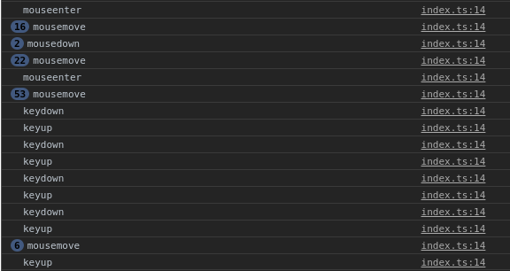

import { CodeWave } from "gatsby-theme-waves";

Un videojuego no es interesante si no existe una forma de interactuar con él.
Puede ser presionar un botón, una combinación de ellos, usar un apuntador,
joystick, o alguna otra cosa similar, pero el juego necesita interacción para
resultar entretenido.

## Creando nuestro primer listener

Los elementos de HTML tienen una serie de funciones que les permiten escuchar y
responder a eventos generados por el usuario u otros elementos del sitio.
En la siguiente tabla puedes ver algunos de estos ellos:

| Nombre     | Cuándo ocurre                                                                                                     |
| ---------- | ----------------------------------------------------------------------------------------------------------------- |
| keydown    | Un botón del teclado fue presionado mientras el elemento está activo. Funciona para todas las teclas.             |
| keypress   | Igual que keydown, pero funciona solo para teclas que producen caracteres (No funciona para `alt` o `ctrl`, etc.) |
| keyup      | Un botón del teclado fue liberado mientras el elemento está activo.                                               |
| mousedown  | Un puntero, como el mouse, hace click (izquierdo o derecho) sobre un elemento.                                    |
| mouseup    | Un botón de un puntero fue liberado dentro de un elemento                                                         |
| mousemove  | Un puntero se movió estando adentro de un elemento                                                                |
| mouseenter | Un puntero entró al área abarcada por un elemento                                                                 |

Antes que nada, para poder utilizar los eventos del teclado es necesario hacer
una pequeña modificación a nuestro archivo `index.html`:

<CodeWave>

```html
<canvas
  id="game-area"
  width="400"
  height="400"
  class="small-shadow"
></canvas>
```

Busca la linea donde nuestro canvas está definido y agrega la propiedad tabindex
con un valor de 0.

```html
<canvas
  id="game-area"
  width="400"
  height="400"
  class="small-shadow"
  tabindex="0"
></canvas>
```

El resultado final debería quedar algo así

</CodeWave>

Después de esto podremos activar eventos de teclado y punteros en nuestro
canvas.

Volvamos ahora a nuestro archivo `index.ts` y limpiémoslo, dejando solamente
estas dos lineas:

```ts
const canvas = document.getElementById("game-area") as HTMLCanvasElement;
const context: CanvasRenderingContext2D = canvas.getContext("2d");
```

Creemos una función para ver los valores de nuestros eventos:

```ts
function listenerGenerico(event) {
  console.log(event.type);
}
```

y agreguemos los listeners correspondientes a nuestro canvas:

```ts
canvas.addEventListener("keydown", listenerGenerico);
canvas.addEventListener("keyup", listenerGenerico);
canvas.addEventListener("keypress", listenerGenerico);
canvas.addEventListener("mousemove", listenerGenerico);
canvas.addEventListener("mousedown", listenerGenerico);
canvas.addEventListener("mouseup", listenerGenerico);
```

Con esto, nuestro canvas está ahora escuchando todos los eventos que definimos,
puedes ver los resultados si abres la consola de tu navegador (normalmente con
la tecla F12) y buscas la pestaña llamada `console`. En mi caso, este fue el
resultado después de jugar un poco con los eventos:



¡Los eventos están funcionando perfectamente! Ahora pongámoslos a prueba con un
dibujo.

## Combinando eventos y figuras

Hasta el momento sabemos cómo dibujar texto y figuras sencillas haciendo uso de
canvas, y podemos hacer funciones reutilizables que nos permitan cambiar solo
algunas propiedades sin necesidad de escribir un montón de código para hacer una
tarea sencilla. Combinemos esto con lo que acabamos de aprender para hacer un
repaso general y poner a prueba lo que conocimos en este post:

<CodeWave>

```ts
const canvas = document.getElementById("game-area") as HTMLCanvasElement;
const context: CanvasRenderingContext2D = canvas.getContext("2d");

function listenerGenerico(event) {
  console.log(event.type);
}

canvas.addEventListener("keydown", listenerGenerico);
canvas.addEventListener("keyup", listenerGenerico);
canvas.addEventListener("keypress", listenerGenerico);
canvas.addEventListener("mousemove", listenerGenerico);
canvas.addEventListener("mousedown", listenerGenerico);
canvas.addEventListener("mouseup", listenerGenerico);
```

Este es el estado actual de nuestro `index.ts`. Borremos algunas lineas que no
vamos a usar de momento.

```ts
const canvas = document.getElementById("game-area") as HTMLCanvasElement;
const context: CanvasRenderingContext2D = canvas.getContext("2d");
canvas.addEventListener("keydown", listenerGenerico);
```

Necesitamos definir una nueva función que nos permita dibujar algo de una forma
sencilla y reutilizable. En mi caso, crearé un cuadrado y cambiaré la función
que nuestro listener está utilizando.

```ts
const canvas = document.getElementById("game-area") as HTMLCanvasElement;
const context: CanvasRenderingContext2D = canvas.getContext("2d");

function drawRect() {
  context.save();
  context.fillStyle = "darkRed";
  context.rect(100, 100, 200, 200);
  context.fill();
  context.restore();
}

function keydownListener(event) {}

canvas.addEventListener("keydown", keydownListener);
drawRect();
```

Con esto tengo el dibujo de un cuadrado sencillo en la pantalla. Quiero poder
reutilizar el código de mi dibujo, así que cambiaré el color a un parámetro de
la función

```ts
const canvas = document.getElementById("game-area") as HTMLCanvasElement;
const context: CanvasRenderingContext2D = canvas.getContext("2d");

function drawRect(color) {
  context.save();
  context.fillStyle = color;
  context.rect(100, 100, 200, 200);
  context.fill();
  context.restore();
}

function keydownListener(event) {}

canvas.addEventListener("keydown", keydownListener);
drawRect("darkred");
```

¡Listo! La función ahora es reutilizable, puedo pasar un color a la función y
esta se encargará de crear un cuadrado con ese color, sin embargo, todavía
falta configurar nuestro listener. Para esto, veamos qué información nos da el
evento para trabajar

```ts
const canvas = document.getElementById("game-area") as HTMLCanvasElement;
const context: CanvasRenderingContext2D = canvas.getContext("2d");

function drawRect(color) {
  context.save();
  context.fillStyle = color;
  context.rect(100, 100, 200, 200);
  context.fill();
  context.restore();
}

function keydownListener(event) {
  console.log(event);
}

canvas.addEventListener("keydown", keydownListener);
drawRect("darkred");
```

Si abrimos ahora la consola y escribimos mientras el canvas está enfocado,
podremos ver que cada tecla tiene un código identificador que la distingue de
las demás. En la siguiente tabla se encuentran los valores para los eventos:

</CodeWave>

| Tecla            | keyCode | code       |
| ---------------- | ------- | ---------- |
| Flecha izquierda | 37      | ArrowLeft  |
| Flecha arriba    | 38      | ArrowUp    |
| Flecha derecha   | 39      | ArrowRight |
| Flecha abajo     | 40      | ArrowDown  |


Conociendo esto, podemos hacer una función sencilla que cambie el color según la
flecha que presionemos. Probémoslo:

<CodeWave>


```ts
const canvas = document.getElementById("game-area") as HTMLCanvasElement;
const context: CanvasRenderingContext2D = canvas.getContext("2d");

function drawRect(color) {
  context.save();
  context.fillStyle = color;
  context.rect(100, 100, 200, 200);
  context.fill();
  context.restore();
}

function keydownListener(event) {
  console.log(event);
}

canvas.addEventListener("keydown", keydownListener);
drawRect("darkred");
```

Este es el estado actual de nuestro código. Borremos el contenido de nuestra
función y creemos algunos valores nuevos. Nuestra intención es crear dibujar el
cuadrado de un color diferente por cada tecla, por lo que podemos usar un 
`switch` para distinguir entre los valores.


```ts
const canvas = document.getElementById("game-area") as HTMLCanvasElement;
const context: CanvasRenderingContext2D = canvas.getContext("2d");

function drawRect(color) {
  context.save();
  context.fillStyle = color;
  context.rect(100, 100, 200, 200);
  context.fill();
  context.restore();
}

function keydownListener(event) {
  switch (event.code) {
    case "ArrowLeft":
      break;
    case "ArrowUp":
      break;
    case "ArrowRight":
      break;
    case "ArrowDown":
      break;
    default:
      break;
  }
}

canvas.addEventListener("keydown", keydownListener);
drawRect("darkred");
```

Con esto nuestro programa está preparado para dibujar el cuadrado según el 
código de color que usemos. Utilizaré algunos colores en css: *darkblue*, 
*magenta*, *brown* y *teal*. 

En el caso de que el usuario presione una tecla que no está indicada en el 
código anterior, dibujaré el cuadrado de color blanco para aparentar que se está
borrando.


```ts
const canvas = document.getElementById("game-area") as HTMLCanvasElement;
const context: CanvasRenderingContext2D = canvas.getContext("2d");

function drawRect(color) {
  context.save();
  context.fillStyle = color;
  context.rect(100, 100, 200, 200);
  context.fill();
  context.restore();
}

function keydownListener(event) {
  switch (event.code) {
    case "ArrowLeft":
      drawRect("darkblue");
      break;
    case "ArrowUp":
      drawRect("magenta");
      break;
    case "ArrowRight":
      drawRect("brown");
      break;
    case "ArrowDown":
      drawRect("teal");
      break;
    default:
      drawRect("white");
      break;
  }
}

canvas.addEventListener("keydown", keydownListener);
drawRect("darkred");
```

¡Perfecto! Con esto, la aplicación está lista para utilizarse. El cuadrado 
cambiará de color cada vez que presionemos una de las flechas del teclado, y se
volverá blanco cuando se utilice una tecla que no tenemos definida.

</CodeWave>

El resultado final debe verse como esto:


Prueba cambiando los colores que definimos, ¡o jugando con nuevas teclas! Con 
esta misma lógica puedes definir el uso de teclas como WASD, ZXCS, o cualquier
preferencia que tengas. 

Además de esto, estas funciones pueden definir el cambio de coordenadas en un
objeto para empezar a mover elementos a través de nuestra pantalla, ¿puedes
imaginar cómo funciona? Prueba jugando con esto y otras propiedades de canvas,
nuestro juego usará estos mismos elementos para crear funciones como movimiento,
selecciones, entre otras cosas.

---

En esta publicación aprendimos a usar listeners para hacer interacciones básicas
con nuestro canvas, que nos permitirá crear juegos sencillos y fáciles. Sin
embargo, nuestro conocimiento actual está limitado a usar solamente figuras
básicas y texto... no es tan fácil hacer juegos tan llamativos aun. Para
solucionar esto, en la siguiente publicación aprenderemos cómo usar recursos
externos como imágenes y sonidos para crear experiencias más divertidas para
nuestros usuarios.